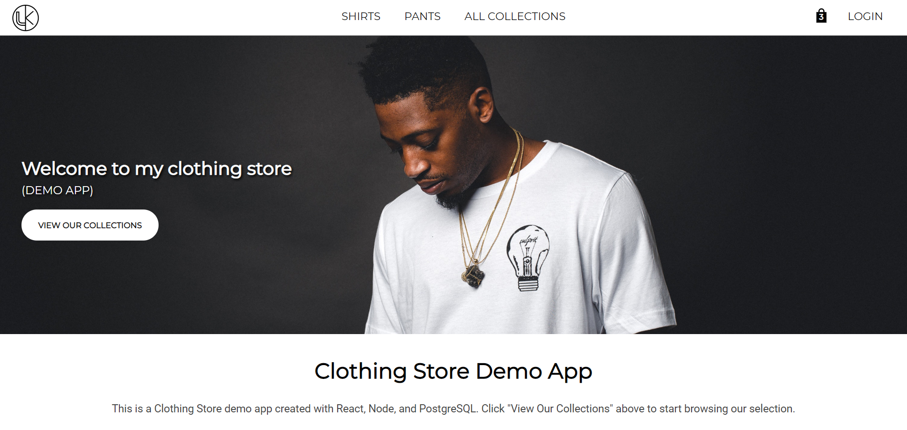
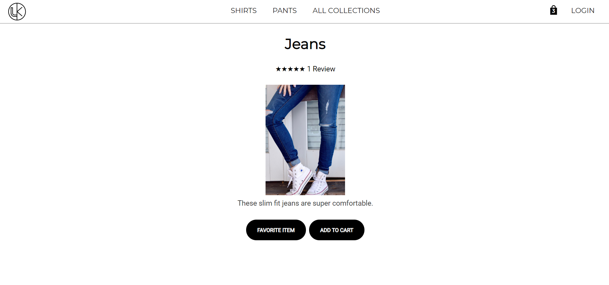

# Clothing Store CLient

This is a full stack clothing store demo app. You can create an account, login, browse collections, products, add products to your cart, create reviews products, and favorite items to save for later. The app utilizes HTML, CSS, and React for the frontend. For the backend it makes use of ExpressJS to expose API endpoints and PostgreSQL to manage the database.

## Demo:

https://clothing-store-client.now.sh/

## API Documentation:

See the server repo:

https://github.com/krogank9/clothing-store-server

## Screenshots:

## Built With:

* React
* Javascript, jQuery, HTML5, CSS
* Server built with ExpressJS, PostgreSQL, Knex
